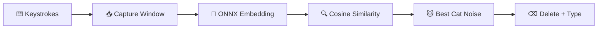

# 🐱 Kitty Mode

<div align="center">

**Transform your keyboard into a cat!**

[](https://opensource.org/licenses/MIT)
[](https://www.python.org/downloads/)
[]()

*When your cat walks across your keyboard, let them speak their truth.* 🐾

[Features](#features) • [Quick Start](#quick-start) • [Usage](#usage) • [Building](#building-from-source) • [Contributing](#contributing)

</div>

---

## ✨ What is Kitty Mode?

Ever had a cat walk across your keyboard and wished their random keysmashes could be translated into proper cat speech? **Now they can!**

Kitty Mode uses AI-powered semantic matching to transform keyboard gibberish into contextually appropriate cat noises. Type "asdfghjkl" and watch it become "*mrrrrooow~*" — it's like having a real-time cat translator! 🎉

```
You type:  asdkjfhaksdjfh
Cat says:  *purrs and stretches* mrrrroooww~
```

## 🎯 Features

| Feature | Description |
|---------|-------------|
| 🧠 **Smart Matching** | AI-powered vector similarity matches your typing to 1050+ cat sounds |
| 🌍 **Multilingual Meows** | International cat noises: *nyan*, *miao*, *miau*, *miyav*, and more! |
| 💻 **Cross-Platform** | Works on Windows and macOS |
| 🔧 **Customizable** | Add your own cat noises, adjust timing, tweak behavior |
| ⌨️ **Quick Toggle** | `Ctrl+Shift+K` to enable/disable instantly |
| 📤 **Auto-Send** | Optionally press Enter after cat noises (purrfect for chat!) |
| 🔒 **Fully Offline** | Bundled ONNX model — no internet required |
| 🐾 **Unobtrusive** | Lives quietly in your system tray until needed |

## 🚀 Quick Start

### 📦 Download (Recommended)

> **Just want to run it?** Grab the latest release!

| Platform | Download | Size |
|----------|----------|------|
| Windows | [`KittyMode.exe`](https://github.com/aslindamood/kittymode/releases/latest) | ~155 MB |
| macOS | [`KittyMode.app`](https://github.com/aslindamood/kittymode/releases/latest) | ~155 MB |

1. Download for your platform
2. Run the application
3. Look for the 🐱 in your system tray
4. Press `Ctrl+Shift+K` to enable — *meow!*

### 🛠️ From Source
```bash
# Clone the repository
git clone https://github.com/aslindamood/kittymode.git
cd kittymode

# Create virtual environment
python -m venv .venv
source .venv/bin/activate  # Linux/macOS
# or: .\.venv\Scripts\activate  # Windows PowerShell

# Install dependencies
pip install -r requirements.txt

# Run (requires data files - see Building section)
python -m kittymode.main
```

## 🎮 Usage

### Basic Controls

| Action | How |
|--------|-----|
| **Toggle On/Off** | `Ctrl+Shift+K` or right-click tray → Enable/Disable |
| **Open Settings** | Right-click tray → Settings |
| **Exit** | Right-click tray → Exit |

### How to Use

1. **Start** the application (look for 🐱 in system tray)
2. **Enable** with `Ctrl+Shift+K` — icon turns green!
3. **Type gibberish** (or let your cat do it)
4. **Watch the magic** as keystrokes become meows~
5. **Disable** with `Ctrl+Shift+K` when done

### ⚙️ Settings

Customize your cat's voice! Right-click tray → **Settings**:

| Setting | Description | Default |
|---------|-------------|---------|
| **Capture Window** | How long to collect keystrokes before converting | 800ms |
| **Extension Threshold** | Extend window if still typing | 200ms |
| **Max Duration** | Maximum capture time | 3000ms |
| **Typing Delay** | Speed of output (0 = instant) | 0ms |
| **Press Enter After** | Auto-send messages | ✅ On |
| **Custom Noises** | Add your own cat sounds! | — |

<details>
<summary>📁 Config file locations</summary>

- **Windows:** `%APPDATA%\KittyMode\config.json`
- **macOS:** `~/Library/Application Support/KittyMode/config.json`

</details>

## 🔨 Building from Source

<details>
<summary><b>Prerequisites</b></summary>

- Python 3.10+
- For ONNX model export: PyTorch and sentence-transformers (development only)

</details>

### Step 1: Generate Cat Noise Database 📚

```bash
python src/kittymode/generate_noises.py
```

Creates `data/cat_noises.json` with **1050+ cat sounds** including:
- 🐱 Base noises (*meow, mrow, purr, hiss*)
- 🌍 International variations (*nyan, miao, miau, mjau*)
- 📢 Vowel elongations (*meeeeoooow*, *nyaaaa~*)
- ❗ Punctuation variations (*meow!*, *MEOW?!*)
- ✨ Action descriptions (**purrs contentedly**)

### Step 2: Generate Vector Embeddings 🧠

```bash
python src/kittymode/generate_embeddings.py
```

Creates the similarity search index:
- `data/embeddings.npy` — Vector embeddings
- `data/noise_index.json` — Index mapping

> 💡 First run downloads sentence-transformers model (~80MB)

### Step 3: Export ONNX Model 📦

```bash
# Install export dependencies
pip install torch sentence-transformers

# Export to ONNX
python scripts/export_onnx.py
```

Creates `models/onnx/` (~88 MB) with model and tokenizer files.

### Step 4: Build Executable 🏗️

<details>
<summary><b>Development Build (Quick)</b></summary>

```bash
pip install pyinstaller pyinstaller-hooks-contrib
python -m PyInstaller --clean kittymode.spec
```

Output: `dist/KittyMode.exe` (Windows) or `dist/KittyMode.app` (macOS)

</details>

<details>
<summary><b>Production Build (Smaller, ~155 MB)</b></summary>

For the smallest executable, use a clean venv without PyTorch:

**Windows (PowerShell):**
```powershell
powershell -ExecutionPolicy Bypass -File ".\scripts\build_prod.ps1"
```

**Manual:**
```bash
python -m venv .venv_prod
.\.venv_prod\Scripts\activate  # Windows
# or: source .venv_prod/bin/activate  # macOS/Linux

pip install onnxruntime numpy pynput pystray Pillow PyInstaller pyinstaller-hooks-contrib
pip install transformers --no-deps
pip install tokenizers huggingface-hub safetensors filelock requests tqdm pyyaml regex packaging

python -m PyInstaller --clean kittymode.spec
```

</details>

<details>
<summary><b>Creating Icons</b></summary>

```bash
python scripts/create_icon.py
```

Creates `assets/icon.ico` (Windows) and `assets/icon.icns` (macOS).

</details>

## 🔐 Permissions

<details>
<summary><b>macOS</b></summary>

Kitty Mode requires Accessibility permission to capture keyboard input:
1. Open **System Preferences** → **Security & Privacy** → **Privacy**
2. Select **Accessibility**
3. Add Kitty Mode to the list

</details>

<details>
<summary><b>Windows</b></summary>

No special permissions required! 

> ⚠️ Some antivirus software may flag keyboard hooks — this is a false positive.

</details>

## 📁 Project Structure

<details>
<summary>Click to expand</summary>

```
kittymode/
├── src/kittymode/           # Main application code
│   ├── main.py              # Application entry point
│   ├── keyboard_listener.py # Keyboard capture
│   ├── similarity_search.py # ONNX-based vector search
│   ├── text_output.py       # Types cat noises
│   ├── generate_noises.py   # Noise database generator
│   └── generate_embeddings.py # Embedding generator
├── data/                    # Generated data files
│   ├── cat_noises.json      # 1050+ cat noises
│   ├── embeddings.npy       # Vector embeddings
│   └── noise_index.json     # Index mapping
├── models/onnx/             # ONNX model (~88 MB)
├── assets/                  # Icons and images
├── scripts/                 # Build utilities
├── tests/                   # Test suite
├── kittymode.spec           # PyInstaller config
└── requirements.txt         # Dependencies
```

</details>

## 🧪 How It Works



1. **Capture**: Collects keystrokes during configurable time window
2. **Embed**: Converts captured text to vector using ONNX Runtime
3. **Search**: Finds closest match from 1050+ cat noises via cosine similarity
4. **Replace**: Deletes original text, types the cat noise
5. **Send**: Optionally presses Enter

## 🧪 Testing

```bash
python -m pytest                           # Run all tests
python -m pytest --cov=kittymode           # With coverage
python -m pytest tests/test_similarity.py -v  # Specific file
```

## 🤝 Contributing

Contributions are welcome! Please:

1. Fork the repository
2. Create a feature branch (`git checkout -b feature/amazing-meow`)
3. Commit your changes (`git commit -m 'Add amazing meow'`)
4. Push to the branch (`git push origin feature/amazing-meow`)
5. Open a Pull Request

Make sure tests pass before submitting! 🧪

## 📄 License

MIT License — See [LICENSE](LICENSE) file for details.

---

<div align="center">

**Made with 😺 for cats and their humans**

*If your cat approves, consider giving this repo a ⭐!*

[Report Bug](https://github.com/aslindamood/kittymode/issues) · [Request Feature](https://github.com/aslindamood/kittymode/issues)

</div>
